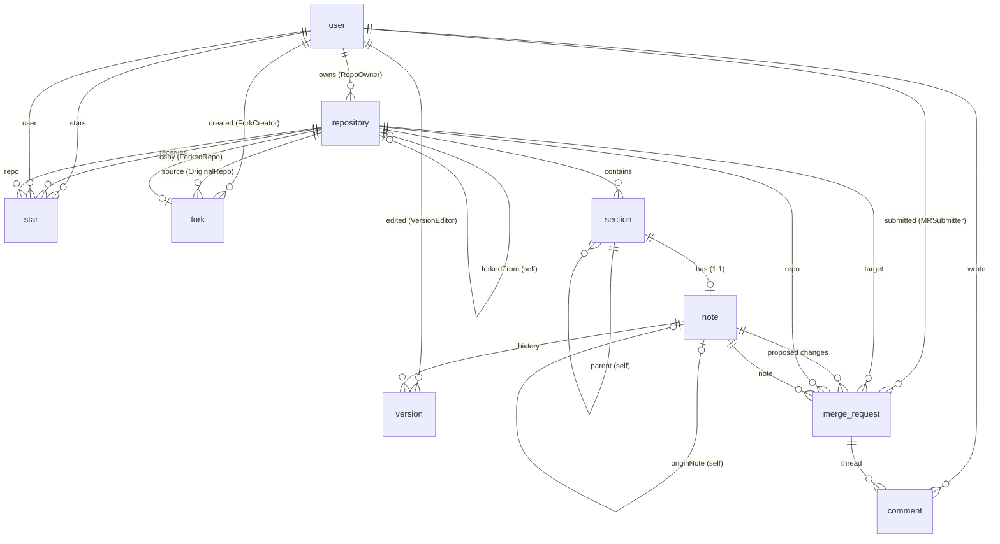

# GitGud — Project Documentation Report

This report describes **GitGud**, a GitHub-style platform for organizing, forking, and collaboratively editing structured notes. It is written from a direct reading of the source code, the Prisma schema, the API routes, and the deployment configuration, and is intended to be read end-to-end.

---

## 1. Project Overview

GitGud is a web application that lets users store knowledge as *repositories of notes*. A repository is a named, optionally public collection of **sections** arranged in a nested tree; each section holds at most one rich-text **note** (authored in the browser with a TipTap editor and stored as JSON). Repositories are the mental model GitHub users already know — but instead of code files, GitGud manages structured, prose documentation (the database is literally named `syllabus_aggregator`, reflecting the original use case of aggregating course syllabi and lecture notes).

The problem it solves: keeping a body of written knowledge (notes, syllabi, how-tos) organized and safely versioned, and letting a community **contribute back to someone else's content safely**. On GitGud you don't edit someone's repo directly — you **fork** it, edit inside your own copy, and submit a **merge request** proposing your changes. The owner reviews a rendered text diff and can **approve** (which merges your new content into their note and credits you) or **reject** with feedback.

It is built for anyone who wants a git-flavored-but-git-free workflow around written notes — students sharing and merging course notes, teams maintaining knowledge bases, or individuals who want per-save version history without running `git` themselves. The core use case is: *discover a public repo → fork it → improve a note → send a merge request → get it merged (with attribution) → repeat.*

---

## 2. Key Features

**Accounts & authentication**
- Sign up with email, username, and password; log in with either email *or* username. Sessions are JWT-based and issued via an `httpOnly` cookie (`gitgud_token`).
- Change your password (requires the current password) and edit profile info (username, display name, bio).

**Repositories & notes**
- Create, edit, rename, and delete repositories. Each repository is `public` or `private`, with an owner-level `(owner, name)` uniqueness guarantee.
- Inside a repo, build a **nested section tree** (sections can have parent sections and siblings are ordered). Each section holds at most one note.
- Notes are rich text edited in a TipTap editor: headings, bullet lists, blockquotes, bold/italic/underline, links, and inline images.
- **Every save creates a new version** of the note, optionally with a short "what changed" summary. A full version history is stored per note and past versions can be loaded back into the editor to restore them.

**Forking**
- Any public repository can be forked into the current user's own workspace. A fork is a complete copy — section tree, notes, and version history. Fork names are automatically deduplicated (`<name>` / `<name> - Copy` / `<name> - Copy 2`, …).
- The database keeps both the fork lineage (`Repository.forkedFromId`) and a dedicated `fork` table recording who forked what and when.

**Merge requests & review workflow**
- From a fork, edit a note and submit a **merge request** targeting the note in the repository the fork originated from (tracked note-by-note via `Note.originNoteId`, so this works even a fork removed).
- The API computes a **flat, semantic text diff** (old note vs. proposed new note) server-side; the UI renders it side-by-side with equal/inserted/deleted segments.
- Owners can **approve** (applies the new content to their note, records a new version credited to the submitter, and marks the MR approved), **reject** with text feedback, or leave it **pending**. Submitters can **cancel** their own MRs. MRs have a comment thread.
- One pending merge request per note at a time (duplicates are rejected with `409`).

**Discovery, starring & profiles**
- A discover page lists all public repositories with search and pagination; you can **star/unstar** them and filter by owned, forked, starred, or discoverable.
- Public profile pages summarize a user's repositories, stars received, forks, and merge requests (received and submitted).

**Avatar uploads**
- Users can upload/delete a profile avatar (JPEG/PNG/WebP/GIF/AVIF, up to 5 MB), served statically from `/uploads`.

---

## 3. Tech Stack

| Layer | Technology | Version | Why it fits |
| --- | --- | --- | --- |
| Frontend framework | Next.js (App Router) | 16.2.10 | File-based routes, server/client components, and a single deployable app. Built with the webpack pipeline (`next dev --webpack`) and React Compiler enabled. |
| UI runtime | React / React DOM | 19.2.4 | Standard component model; pairs with Next.js 16 and TipTap. |
| Rich text editing | TipTap | ^3.31.3 (`@tiptap/react`, `starter-kit`, `underline`, `link`, `image`, `placeholder`, `pm` packages) | Headless ProseMirror-based editor producing JSON documents that this product stores and diffs. |
| Icons | lucide-react | ^1.28.0 | Lightweight icon set for the dashboard/nav UI. |
| Backend framework | NestJS | ^11.0.1 (`@nestjs/core`, `common`, `platform-express`) | Structured, module-based Node HTTP API with decorators, guards, and DTO validation. |
| Auth | @nestjs/jwt + Passport (`@nestjs/passport` + `passport-jwt`), `bcryptjs`, `cookie-parser` | @nestjs/jwt ^11.0.2, passport ^0.7.0, passport-jwt ^4.0.1, bcryptjs ^3.0.3, cookie-parser ^1.4.7 | Password hashing (bcrypt, 10 rounds) + JWT delivered via `httpOnly` cookie; custom `JwtAuthGuard` reads the cookie on every protected request. |
| ORM | Prisma (v7 client + toolkit) | @prisma/client ^7.0.0, @prisma/adapter-pg ^7.9.1 | Strongly typed schema-first data layer, used with the driver adapter (`PrismaPg`). |
| Database | PostgreSQL | 15 (`postgres:15-alpine` in Docker) | Relational integrity for ownership, cascades, and unique constraints; JSON column type hosts TipTap documents. |
| Diff engine | `diff-match-patch` | ^1.0.5 | Google's Diff Match Patch used to compute sem text diffs between two note documents server-side. |
| File uploads | multer (via `@nestjs/platform-express`) | multer ^2.4.0 | Disk-storage avatar uploads with type filtering and size limits. |
| Validation | class-validator + class-transformer | ^0.15.1 / ^0.5.1 | DTO decoration with a global `ValidationPipe` (`whitelist: true, transform: true`). |
| SQL driver | `pg` | ^8.22.0 | PostgreSQL client used by the Prisma driver adapter. |
| Deployment | Docker Compose | — | Three services: `GitGud_db` (Postgres), `GitGud_backend` (NestJS), `GitGud_frontend` (Next.js), sharing a bridge network and a named volume for data. Containers run as UID 1000 with bind mounts + polling for live dev.

---

## 4. System Architecture

```mermaid
flowchart LR
    subgraph Browser
        UI[Next.js / React app :3000]
    end

    subgraph GitGud_network ["Docker network: GitGud_network"]
        FE["frontend (GitGud_frontend)
            Next.js 16 App Router"]
        BE["backend (GitGud_backend)
            NestJS 11 API :4000"]
        DB[("postgres (GitGud_db)
            PostgreSQL 15")]
    end

    UI -->|proxied by| FE
    FE -->|"fetch / lib/api.ts, /lib/http.ts (apiFetch)"| BE
    FE -->|""| MDW["middleware.ts
                     cookie gate"]
    BE -->|"PrismaClient w/ PrismaPg adapter"| DB
    BE --> STATIC["/uploads (avatars)"]
```

- The frontend calls the backend with plain `fetch` through `frontend/src/lib/http.ts` (`NEXT_PUBLIC_API_URL || http://localhost:4000`). Every request includes the `gitgud_token` cookie, and a `401` response redirects the browser to `/auth`.
- `frontend/src/middleware.ts` runs on every request and redirects unauthenticated visitors (no cookie) away from app pages to `/auth`.
- The backend bootstraps in `backend/src/main.ts` with `cookieParser()`, a static `/uploads` mount, CORS for `http://localhost:3000` (credentials on), and a global `ValidationPipe`.
- NestJS modules (defined in `backend/src/app.module.ts`): `AuthModule`, `PrismaModule`, `RepoModule`, `MergeRequestModule`. `RepoModule` hosts both `RepoController` and `ProfilesController`.

### Request flow A — Fork & merge request

1. Samantha is in `/discover`; she opens a public repo (`GET /repositories/:id`) and clicks Fork.
2. `POST /repositories/:id/fork` → `RepoService.forkRepository` runs a **single interactive transaction** (`createRepositoryInTx`) that copies the repo row, the full section tree, every note (with `originNoteId` pointing at the source note), and one initial `Version` per note (summary `Forked from "<origin>"`), plus a `fork` row recording `originalRepoId`, `forkedRepoId`, `forkedBy`, then renames to a unique name via `resolveForkName`.
3. Sam edits a note: `PATCH /repositories/:forkId/notes/:noteId` → `saveNote` atomically updates the note content **and** inserts a new `Version`.
4. Sam submits `POST /merge-requests` (`CreateMergeRequestDto`: `repoId` = fork, `noteId` = fork note, `content` = new JSON). `createMergeRequest` resolves the true origin repo via `Note.originNoteId`, stores `oldContent` (fork's origin snapshot) and `newContent` (proposal), status `pending`. A duplicate pending MR on the same note is rejected `409`.
5. The owner opens `GET /merge-requests/:id`; the API pre-renders the diff via `computeFlatDiff(oldContent, newContent)` (`backend/src/repo/diff.util.ts`), converting TipTap JSON → plain text with `docToPlainText` and running `diff-match-patch` to a `FlatDiffRow[]` that `DiffView.tsx` renders side-by-side.
6. Owner clicks Approve → `PATCH /merge-requests/:id` (`UpdateMergeRequestDto`, status `approved`). `updateMergeRequest` applies the change in one transaction: origin note content updated, a new `Version` created and credited to the submitter, MR status set to `approved`. Reject writes `feedback`.

### Request flow B — Authentication

1. `POST /auth/signup` (`SignupDto`: `email`, `username`, `password`) → `AuthService.signup` hashes the password with bcrypt (10 rounds), creates the user, and `issueToken` (`backend/src/common/utils/jwt.utils.ts`) mints a JWT (`sub`, `email`, `username`; `expiresIn: '7d'`).
2. The controller sets an `httpOnly`, `sameSite=lax`, path-`/` cookie named `gitgud_token` (7-day max age) and returns the user.
3. On later navigation, `middleware.ts` checks for the cookie; inside protected pages, `AuthContext` calls `GET /auth/me` (protected by `JwtAuthGuard`, which verifies the cookie JWT) to hydrate the current user.
4. `POST /auth/login` accepts an `identifier` (email **or** username) plus password; `POST /auth/logout` clears the cookie.

---

## 5. Database Design

Schema source: `backend/prisma/schema.prisma` (PostgreSQL provider, Prisma client generator). All 9 tables use UUID primary keys and snake_case table names via `@@map`.



Key relationships and enforcement rules:

- **Repository ownership** — `Repository.ownerId → User`, `onDelete: Cascade`. Deleting a user (not exposed by the API) would cascade to their repos. `@@unique([ownerId, name])` guarantees one repo per name per owner — this constraint is the source of the `409 Conflict` returned on duplicate create/rename.
- **Section tree** — `Section` has a self-relation `parent` (`onDelete: Cascade`), so deleting a parent destroys its children; deleting a repo cascades to all sections (`repoId ... onDelete: Cascade`). Ordering is a plain integer `order` per sibling group. The API refuses reparenting that would create a cycle (`wouldCreateCycle` → `400`).
- **One note per section** — `Note.sectionId` is `@unique`; each section holds at most one note, and a note belongs to exactly one section (`onDelete: Cascade`).
- **Fork lineage (two representations)** — `Repository.forkedFromId` is a nullable self-FK giving repo-level lineage; a separate `fork` table stores `originalRepoId`, `forkedRepoId` (`@unique`) and `forkedBy`. Both sides cascade on repo delete, so deleting an origin deletes its fork records. Note-level lineage (`Note.originNoteId`, optional, `onDelete: SetNull`) is how merge requests find the true origin even from nested forks.
- **Version history** — `Version.noteId → Note` (`onDelete: Cascade`). Every save inserts a full JSON snapshot `content` plus optional `changeSummary`, and `editedBy` credits the editor. `versionNumber` is derived from `versions.length`, not stored.
- **Merge requests & comments** — `MergeRequest.repoId` and `MergeRequest.noteId` are required FKs (`onDelete: Cascade`); `submittedBy → User` credits the requester. `status` is a string (`pending | approved | rejected | cancelled`). Threads are `Comment` rows under the MR.
- **Stars** — `Star` has `@@unique([userId, repoId])`; duplicates are impossible by schema.

---

## 6. Authentication & Security

### Auth approach actually implemented

- **Passwords** are hashed with **bcryptjs** (10 salt rounds) at signup; plaintext is never stored.
- **Sessions** are JSON Web Tokens (`jsonwebtoken` via `jwt.utils.ts`) with `sub`, `email`, `username`, `expiresIn: '7d'`, signed with `process.env.JWT_SECRET`.
- Tokens are transported in an **`httpOnly` cookie** named `gitgud_token` (`sameSite=lax`, `path=/`, 7-day max age). Because it is `httpOnly`, page JavaScript cannot read it — an XSS alone cannot exfiltrate the session.
- `JwtAuthGuard` (`backend/src/common/guards/jwt-auth.guard.ts`) is the single enforcement point: it reads the cookie, verifies the JWT, and attaches `req.user`. Every controller in `RepoModule`, `MergeRequestModule`, and `ProfilesController` is `@UseGuards(JwtAuthGuard)`; auth routes use it for `/me` and `/change-password`.
- The API never stores or returns `password`. `ValidationPipe { whitelist: true, transform: true }` strips unknown body fields globally.
- Frontend-side, `middleware.ts` and the `apiFetch` 401 handler in `lib/http.ts` enforce the UX-side session gate.

### Security audit summary

A security/data-integrity audit was performed against this exact codebase. 12 issues were found and fixed; the current state below is verified against the code as it stands now, plus a 30-case live smoke run against the running container and direct DB integrity queries.

| Category | What was checked | Current state |
| --- | --- | --- |
| **Auth** | Secret handling, token expiry, cookie flags, password storage, login identifier handling | Verified. bcrypt(10) hashing, 7-day JWT, `httpOnly`+`sameSite=lax` cookie. Login accepts email or username without revealing which field failed. Residual: `JWT_SECRET` falls back to a hardcoded dev string `'dev-secret-change-me'` if unset, and the cookie is `secure:false` (correct for local HTTP, but must flip to `secure:true` on HTTPS). |
| **Authorization / ownership** | Every repo/section/note mutation must be owner-only; private repos must block non-owners; profile endpoints must not leak private data | Verified. `assertOwnership` guards all repo mutations; `GET note`, `GET note versions`, and **MR creation** on private repos return `403`. `getUserProfile` hides `mergeRequestsReceived` counts of private repos from non-owners. Two `403` leaks fixed (note versions list; MR submission to a private repo). |
| **Fork logic** | Atomicity, name uniqueness, origin tracking, self-fork/private-fork rules | Verified. Forking is a single transaction (repo + sections + notes + initial versions + fork row) with no partial forks possible; unique names via `resolveForkName`; self-fork and private-fork are blocked. DB check: **0 orphan forks**. |
| **Data integrity** | Valid documents, version counting, atomic save/approve, no drift between note and versions | Verified. `createNote` writes a valid TipTap doc (`{type:'doc', content:[{type:'paragraph'}]}`); `versionNumber` is computed from real rows (spurious `1` when empty fixed); saves and MR approves are transactional. DB check: **0 versions with missing notes**. |
| **Error handling** | No leaked internals, correct status codes, race-safe uniqueness | Verified. Duplicate/re-raise cases return `409` (repo create & rename, duplicate pending MR), missing resources `404`, misuse `400` (self-star, section cycles). Raw DB errors are not returned to clients. |
| **Validation & input** | DTO validation, file upload rules, index/query guards | Verified. Global whitelist pipe; avatar uploads restricted to `image/*` with a 5 MB cap; list queries paginate (`limit <= 50`). |

### Residual risks & intentional scope

- **No rate limiting** on `/auth/login` or `/auth/signup`; no lockout or brute-force protection.
- **No CSRF token** — `sameSite=lax` mitigates cross-site state-changing requests, but a service explicitly marked for sharing across sites (or a lax-incompatible same-site subdomain attack) would want a defense-in-depth token.
- **`JWT_SECRET` default** — the shipped dev fallback must be overridden (`.env`) before any non-local deployment.
- **Avatar trust** — upload filtering checks `mimetype` only (no magic-byte sniffing) and stores on disk; fine for the 5 MB dev cap.
- **No email verification or password-reset flow** — signup accounts are immediately active; lost passwords require admin/database recovery.
- **No automated test suite** — verification for this version was a manual + live smoke audit, not CI tests.
- **Note content is stored/rendered as structured JSON** (TipTap doc) rather than sanitized HTML — safe by construction, but images are embedded/URL-based within the document, so there is no separate asset service for note media.

---

## 7. API Summary

Base URL: `http://localhost:4000` (configurable via `NEXT_PUBLIC_API_URL`). All routes below the **Guarded** block require the `gitgud_token` cookie. DTOs are validated per route.

| Resource | Method & route | Purpose |
| --- | --- | --- |
| **Health (public)** | `GET /` | Health check: `{ status, service: "gitgud-api", uptime }` |
| **Auth** | `POST /auth/signup` | Create account; sets session cookie. DTO: email, username, password (≥8) |
| | `POST /auth/login` | Login with email or username; sets session cookie |
| | `POST /auth/logout` | Clears the cookie |
| | `GET /auth/me` (guarded) | Current user profile from token |
| | `POST /auth/change-password` (guarded) | Requires `currentPassword` + new password |
| **Repositories** (all guarded) | `POST /repositories` | Create repo w/ optional nested sections+notes. `409` on duplicate name |
| | `GET /repositories` | List; query: `scope=owned\|forked\|discover\|starred`, `search`, `page`, `limit` |
| | `GET /repositories/:id` | Repo detail with section/note tree; `403` for private non-owner |
| | `PATCH /repositories/:id` | Rename / change visibility / description. `409` on duplicate name |
| | `DELETE /repositories/:id` | Delete repo (cascades) |
| | `POST /repositories/:id/fork` | Fork the repo (single tx); unique `name - Copy` naming |
| | `POST /repositories/:id/star` | Star a repo (`409`/`400` on self-star attempt) |
| | `DELETE /repositories/:id/star` | Unstar |
| | `GET /repositories/:id/starred` | Whether current user starred it |
| **Sections** (all guarded) | `POST /repositories/:id/sections` | Add a section (title, `parentId`, `order`) |
| | `PATCH /repositories/:id/sections/:sectionId` | Rename / reorder / reparent; cycle prevention returns `400` |
| | `DELETE /repositories/:id/sections/:sectionId` | Delete section (cascades to children + note) |
| **Notes** (all guarded) | `POST /repositories/:id/sections/:sectionId/note` | Create the section's note |
| | `GET /repositories/:id/notes/:noteId` | Note + latest version info |
| | `PATCH /repositories/:id/notes/:noteId` | Save note (creates a new Version); body `content` + optional `changeSummary` |
| | `GET /repositories/:id/notes/:noteId/versions` | Full version history for the note |
| **Profiles** (all guarded) | `GET /profiles/:userId` | Public profile (repos, stars, forks, MR counts — private MRs hidden for others) |
| | `PATCH /profiles/:userId` | Update own username/name/bio |
| | `POST /profiles/:userId/avatar` | Upload avatar (multer, `image/*`, ≤5 MB) |
| | `DELETE /profiles/:userId/avatar` | Remove avatar |
| **Merge requests** (all guarded) | `POST /merge-requests` | Submit MR (repo, note, title, description, content). `409` on duplicate pending; `403` on private/own repo |
| | `GET /merge-requests` | List; filters: `repoId`, `status`, `scope=submitted\|received` |
| | `GET /merge-requests/:id` | MR detail incl. computed diff + comments |
| | `PATCH /merge-requests/:id` | Set status (`approved`/`rejected`) with `feedback`; transactional approve |
| | `PATCH /merge-requests/:id/cancel` | Submitter cancels a pending MR |
| | `POST /merge-requests/:id/comments` | Add a comment to the thread |

---

## 8. Project Structure

```
git-gud/
├─ docker-compose.yml          # postgres + backend + frontend (dev-friendly: bind mounts, polling)
├─ .env.example                # POSTGRES_*, API_PORT, JWT_SECRET placeholders (root .env for local)
├─ backend/
│  ├─ Dockerfile               # node:20-alpine, UID 1000, runs `npm run start:dev`
│  └─ src/
│     ├─ main.ts               # bootstrap: cookieParser, /uploads static, CORS, ValidationPipe
│     ├─ app.module.ts         # AuthModule | PrismaModule | RepoModule | MergeRequestModule
│     ├─ app.controller.ts     # GET / health
│     ├─ auth/                 # auth.controller, auth.service, auth.module, dto/auth.dto.ts
│     ├─ repo/                 # Repo + Profiles controllers, RepoService, diff.util, dto/*
│     ├─ merge-request/        # MR + comments controllers/service, dto/*
│     ├─ common/               # guards/jwt-auth.guard.ts, decorators/current-user..ts, utils/jwt.utils.ts
│     ├─ prisma/               # prisma.service (PrismaClient + PrismaPg adapter), module
│     └─ types/                # shared TS types (UserRecord)
│  └─ prisma/
│     ├─ schema.prisma         # 9 models, cascades, maps (source of §5)
│     ├─ seed.ts + seed-data.json    # demo users, repos, forks, MRs, stars
│     └─ migrations/           # 8 migrations: init → dashboard → note-origin → profile/avatar
├─ frontend/
│  ├─ Dockerfile               # node:20-alpine, runs `npm run dev` (webpack, polling)
│  └─ src/
│     ├─ middleware.ts         # cookie gate → /auth
│     ├─ app/
│     │  ├─ layout.tsx / page.tsx          # root layout + public landing
│     │  ├─ auth/page.tsx                  # login/signup
│     │  ├─ (app)/layout.tsx               # authed shell (Navbar + SidePanel + LayoutContext)
│     │  ├─ (app)/dashboard/page.tsx, new-repo/page.tsx
│     │  ├─ (app)/discover, starred, my-repositories, my-forks, merges
│     │  ├─ (app)/merge-requests/[mid]/page.tsx
│     │  ├─ (app)/repos/[id]/page.tsx, /edit/page.tsx, /merge-requests/page.tsx
│     │  │   └─ /merge-requests/[mid]/page.tsx   # legacy path → redirect
│     │  ├─ (app)/profile/[userId]/page.tsx
│     │  ├─ (app)/settings/page.tsx
│     │  ├─ context/            # AuthContext, LayoutContext
│     │  └─ global.d.ts / globals.css
│     ├─ components/            # Navbar, SidePanel, RepoBrowser, RepoCard, SectionTree,
│     │   │                     # SectionTreeBuilder, NoteEditor, DiffView, OverlayCard (+ CSS/)
│     └─ lib/                   # http.ts (apiFetch + 401 redirect), api.ts, repositories.ts,
│                               # sections.ts, notes.ts, mergeRequests.ts, format.ts
```

---

## 9. Challenges & Design Decisions

1. **Fork lineage tracked in three places on purpose.** A fork records repo-level lineage (`Repository.forkedFromId`), an audit `fork` table (`who/what/when`, plus `@unique` on the copy), and note-level lineage (`Note.originNoteId`). The note-level link is the load-bearing one: merge requests need to know the *true origin note* even if a chain of forks exists, and `originNoteId` gives that without walking the repo tree — while the self-FK keeps repo queries cheap and the `fork` table answers "who forked my repo."
2. **Full JSON snapshots per save instead of deltas.** Version history stores the entire TipTap document per save and derives `versionNumber` from row counts. This is storage-inefficient but drastically simpler than storing diffs, and it makes "restore" a one-query operation. The diff is *computed on demand* server-side only when an MR is viewed — history browsing never pays for diff cost.
3. **Text-level diff, not structural.** Diffing structured JSON trees directly would produce noisy, edits-in-`order`-arbitrary output. Instead `docToPlainText` (in `repo/diff.util.ts`) flattens the TipTap doc into readable text (markdown-style headings and list bullets), then `diff-match-patch` computes a semantic text diff that renders cleanly side-by-side. Trade-off: formatting-only changes don't show as diffs, but human reviewers get a legible proposal.
4. **Atomicity over convenience in the two trickiest paths.** Forking (repo + tree + notes + versions + fork row) and MR approval (origin note update + credited version + status) each run in a single interactive `$transaction`. The cost is a fork-helper sort of code complexity in `seed.ts`/`forkRepository`; the benefit is that a crash mid-operation can never leave a half-copied repo or a merged-but-uncredited MR. The audit specifically found and fixed non-atomic versions of both.
5. **Cookie-authenticated JWT with a strict guard choke-point.** Routing every session through one `JwtAuthGuard` (reads cookie, verifies, sets `req.user`) plus `httpOnly` cookies keeps auth policy in a single file, keeps tokens out of JS, and lets the frontend gate itself with `middleware.ts`. The deliberate trade-off is CSRF exposure, mitigated by `sameSite=lax` rather than a token, and no refresh-token rotation in this version.

---

## 10. Future Improvements

- **Automated test suite.** Jest/eslint scaffolding exists but no tests are shipped; the security/data-integrity audit was verified live instead. Adding controller/service unit tests (especially fork atomicity and MR-approve transactions) would make the guarantees durable.
- **Rate limiting & brute-force protection** on `/auth/login` and `/auth/signup`; **email verification and password-reset** flow.
- **CSRF token + `secure` cookie + JWT rotation/refresh**, and removing the hardcoded `JWT_SECRET` dev fallback for production.
- **Multi-hop merge requests.** Currently an MR targets the note's immediate `originNoteId`; chained contributions (fork-a-fork) can't be proposed back up the lineage.
- **Conflict handling on approve.** Approval applies last-write-wins; detecting that the origin note changed since the MR was created (and offering a re-diff) would prevent silent clobbering.
- **Note-media storage.** Image content lives inside the TipTap document; a dedicated asset store with upload validation would decouple media from the JSON and reduce stored-document size.
- **Search & discovery depth**: full-text search over note content, pagination for merge requests, and an activity/notification feed for MRs and stars.
- **Avatar hardening**: magic-byte/content sniffing in addition to `mimetype` filtering.

---

*Verified against the current codebase: all API routes, the Prisma schema, DTOs, auth guard, container configuration, and the audit-bug fixes described in §6 reflect `docs/PROJECT_REPORT.md` final state (backend + frontend builds and lint clean; 30/30 live smoke checks passed; 0 orphan forks, 0 versions with missing notes in the database).*